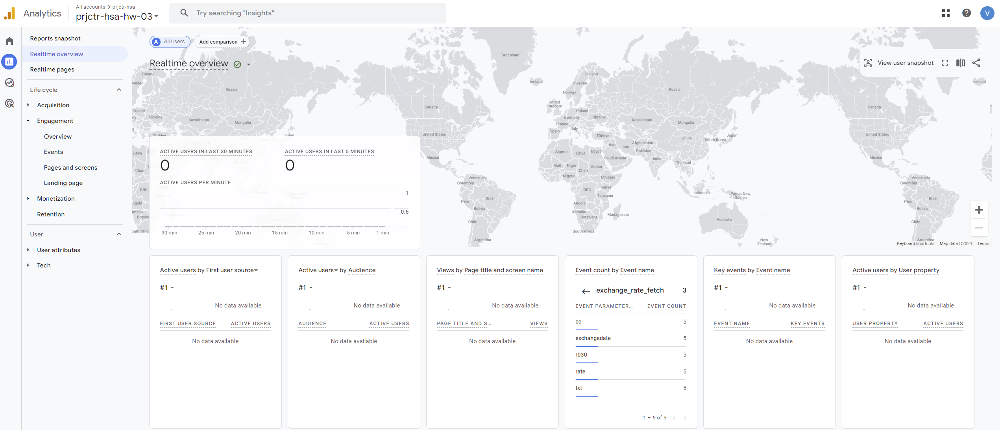

Customize GA:

Create your own property (GA)
Learn about GAMP 
Create backend worker that will push once per hour to Google Analytics info about current uah/usd ratio that can be taken from here
Expected Result: 
public github repo with the worker
Account in google analytics with events that reflect uah/usd exchange rate 

